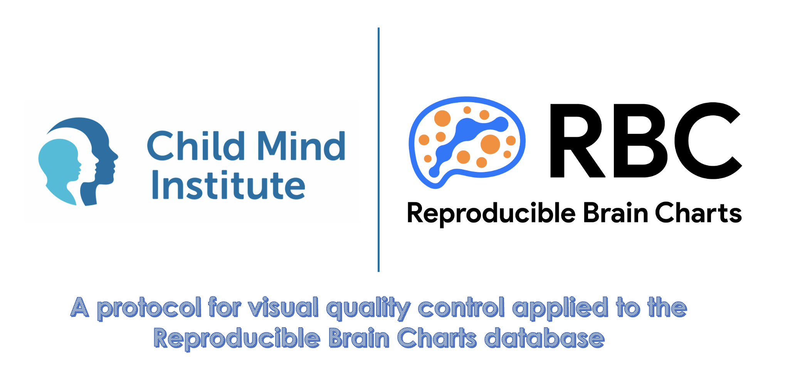

<picture>
  
</picture>

----

This is a repository with the relevant contents for the poster **A protocol for visual quality control applied to the Reproducible Brain Charts database**, presented at Organization for Human Brain Mapping (OHBM 2023). In this work, we present a workflow for trained raters to perform visual quality control for the anatomical images of the RBC initiative. 

> This initiative contains data from five neuroimaging studies:
> - [Brazilian High-Risk Cohort](https://pubmed.ncbi.nlm.nih.gov/25469819/)
> - [Chinese Color Nest Project](https://pubmed.ncbi.nlm.nih.gov/34653938/)
> - [Healthy Brain Network](https://www.nature.com/articles/sdata2017181)
> - [Philadelphia Neurodevelopmental Cohort](https://pubmed.ncbi.nlm.nih.gov/25840117/)
> - [Rockland Sample](https://pubmed.ncbi.nlm.nih.gov/23087608/)

----

## Relevant information

- [Abstract](OHBM_RBC-abstract.pdf)
- [Poster](OHBM_RBC-poster.pdf)
